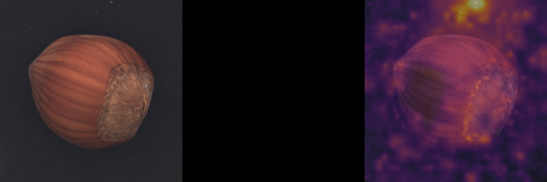
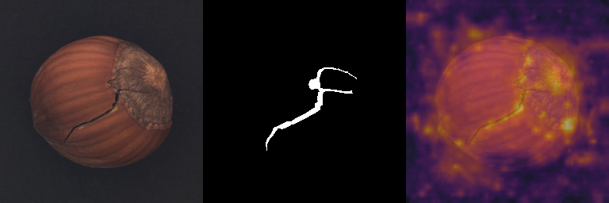
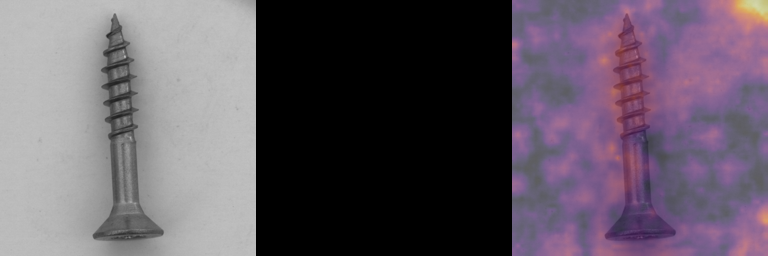
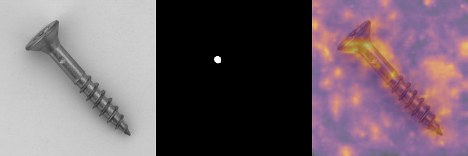

# Looking through the Week 3 results

The first set of runs gave us 90.17 ± 0.99% image AUROC and 95.41 ± 0.59% pixel AUROC. These come from all 15 MVTec categories, with three seeds per category and 500 epochs per run. The [full table](week3.md) shows the results for each category.

The overall numbers hide some large differences. Bottle and leather work well, while hazelnut and screw are much weaker at telling normal and defective images apart. This shows up across all three seeds, so it is worth looking beyond a single unlucky run.

## Starting with the weak categories

| Category | Image AUROC (%) | Pixel AUROC (%) |
| --- | ---: | ---: |
| bottle | 99.95 | 98.06 |
| hazelnut | 59.25 | 93.16 |
| screw | 69.90 | 94.19 |

These are averages over the three seeds. Image AUROC measures how well defective images rank above normal images. Pixel AUROC measures how well defect pixels rank above normal pixels. A reasonably high pixel score does not guarantee that the model gives the whole image a useful score.

Before interpreting the heatmaps, we checked the calculations. Recomputing the metrics from the saved maps and official masks reproduced the results for all 45 runs. We also loaded the bottle, hazelnut and screw seed-0 models and ran their test images again. The maps agreed apart from tiny floating-point differences. The pretrained backbone weights were unchanged in every model.

Those checks did not reveal a scoring-file or label mismatch that explains the weak results. The next step was to look at where the scores were coming from.

## Looking at the heatmaps

For each image below, the left panel is the input, the middle is the dataset's defect mask, and the right is the heatmap overlay. Brighter areas have higher anomaly scores within that image. Each heatmap has its own color scale, so brightness cannot be compared directly between images.

Our image score is the single highest value in the map. That means a response in the background can determine the score even when the product itself looks normal.

### Normal hazelnut

This image is labelled normal, which is why its defect mask is black. There are strong responses in the background around the hazelnut. This is one of the normal images that repeatedly ranks above many defective images.



### Cracked hazelnut

Here the heatmap responds along parts of the crack, but there are also responses around the object and in the background. Seeing part of the defect is not enough if normal images receive higher peak scores.



### Normal screw

The strongest visible response is near the top-right corner, away from the screw. Since we take the maximum map value, that area can dominate the image score.



### Screw with a neck scratch

The labelled defect is very small. The heatmap responds over a much wider area, including the screw and background, rather than clearly separating the small marked region. This example shows why the pixel AUROC alone is not enough to judge the localization.



## Checking whether this appears in more images

To go beyond these examples, we counted where each map reached its maximum. The table shows how often normal-image peaks fell within the outer 16 pixels, and how often defective-image peaks fell inside the labelled defect. Each percentage is averaged across the three seeds.

| Category | Normal peaks in outer 16 pixels (%) | Defective-image peaks inside defect mask (%) |
| --- | ---: | ---: |
| bottle | 8.33 | 85.71 |
| hazelnut | 55.00 | 52.38 |
| screw | 57.72 | 13.73 |

Border peaks are much more common for hazelnut and screw than for bottle. This supports looking at unwanted responses outside the product, but the border is only a rough check. It does not tell us which pixels actually belong to the background. We chose 16 pixels for this inspection, not as a crop to apply to the model.

## Trying a different way to score the image

If one high response can dominate the score, a simple check is to average the map instead. We tried that on the same saved maps, without retraining. The table includes every category to show both the improvements and the drops.

| Category | Maximum score: image AUROC (%) | Mean score: image AUROC (%) |
| --- | ---: | ---: |
| bottle | 99.95 | 94.26 |
| cable | 85.79 | 87.38 |
| capsule | 88.63 | 85.77 |
| carpet | 98.98 | 75.79 |
| grid | 98.55 | 70.48 |
| hazelnut | 59.25 | 88.08 |
| leather | 100.00 | 98.64 |
| metal_nut | 87.80 | 85.53 |
| pill | 91.53 | 87.47 |
| screw | 69.90 | 60.16 |
| tile | 98.61 | 98.34 |
| toothbrush | 87.87 | 95.46 |
| transistor | 93.08 | 87.51 |
| wood | 98.25 | 98.36 |
| zipper | 94.32 | 97.53 |

Hazelnut improves from 59.25% to 88.08%, but screw drops from 69.90% to 60.16%. Carpet and grid also drop substantially. Averaging therefore does not give us a general fix. It shows that the way we turn a map into an image score matters, and that the same change can help one category while hurting another.

This check came after looking at the test results. We kept the original maximum-score results as the baseline. Any scoring change we develop from these observations needs a separate validation plan.

## Comparing with the paper

The [FastFlow paper, Table 1](https://arxiv.org/html/2111.07677v2) reports 97.9% image AUROC and 97.2% pixel AUROC for ResNet-18. We are below both, especially at image level.

There is another useful comparison in the [unofficial implementation](https://github.com/gathierry/FastFlow#performance) that Anomalib builds on. It reports about 95.6% pixel AUROC at epoch 500, close to our 95.41%. Its 97.2% result uses the best evaluated epochs. We used the final epoch for every run. The repository's [evaluation code](https://github.com/gathierry/FastFlow/blob/master/main.py) computes pixel AUROC, so this comparison does not explain our image-level gap.

There are still differences to account for. We used no augmentation, newer dependencies, and binary masks resized with nearest-neighbor interpolation. Anomalib also generates the random flow permutations differently from the reference. Our model has 5,574,912 trainable parameters, while the paper lists about 4.9 million additional parameters. The reference repository notes this parameter-count discrepancy too. We have not isolated which differences, if any, explain the lower scores.

## Next on the schedule

Week 4 is the backbone comparison: ResNet-18 vs. WideResNet-50. These runs give us the ResNet-18 results to compare against. We will keep the dataset split, seeds and evaluation procedure consistent and document any backbone-specific settings. The comparison should show whether the larger feature extractor helps overall and on the weaker categories, as well as how it affects training time and memory.

The heatmap observations are notes for the later failure analysis. They do not require us to design a fix before starting Week 4. The remaining gap from the paper will stay documented alongside the results.

## Running the checks again

```sh
python scripts/audit_week3.py
python -m unittest discover -s tests -v
python scripts/audit_week3_report.py
```

The audit needs the local dataset, saved maps and checkpoints, and a CUDA GPU for replay. The detailed output is in [checks.json](audit/checks.json), with per-image coordinates in [peak_locations.csv](audit/peak_locations.csv).

<details>
<summary>Details of the checks</summary>

- All 45 image AUROC, pixel AUROC and pixel average precision values matched the recalculated values within 1e-12.
- Image order, labels, mask paths, finite maps, map maxima, protocol hashes and 500 consecutive training epochs were checked.
- Saved backbone tensors matched the verified pretrained weights for every run. Study source files matched their saved hashes.
- Replayed maps for bottle, hazelnut and screw seed 0 differed by less than 2e-7.
- A trained flow block from each replayed model agreed with the installed FrEIA block when given the same parameters and input.
- All four automated tests passed, covering cached features and accumulated gradients, checkpoint resume, and result summaries.

</details>
